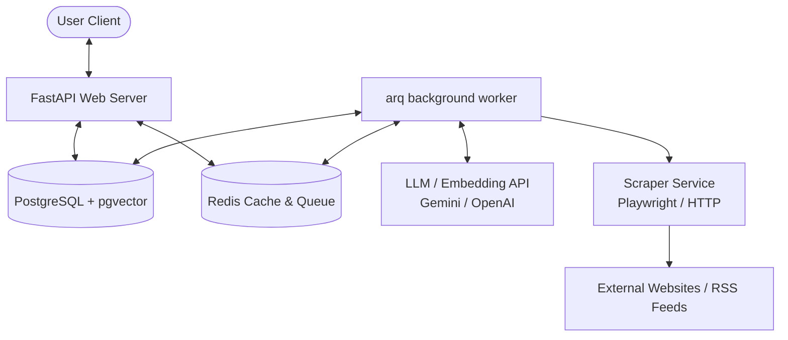

# AI-RSS System Design Document

This document outlines the architecture, features, database design, and project structure for the **AI-RSS** platform, an advanced news aggregation and analysis system. Unlike traditional RSS readers, AI-RSS incorporates a powerful AI layer to scrape dynamic websites, filter feeds semantically, generate summaries and translations, and support conversational Q&A over subscription history.

---

## 1. Feature Map & Functionality

### 1.1 Core RSS Engine
*   **Multi-format Feed Parsing**: Native support for RSS 2.0, Atom, and JSON Feed.
*   **User Subscription Management**: Group feeds into folders/categories, toggle read/unread status, and bookmark/star articles.
*   **OPML Import/Export**: Easy migration from traditional RSS readers.

### 1.2 AI Agent Crawler (RSS-ifier)
*   **Dynamic Scraper Agents**: Turn any website (including those without standard RSS feeds) into an RSS source.
*   **Instruction-Driven Crawling**: Users can specify natural language instructions (e.g., *"Check this page daily, look for announcements about PyTorch, extract the title and link, and ignore sponsored content"*).
*   **Browser Rendering**: Dynamic JS rendering support via Playwright/Puppeteer integrations.
*   **Automatic Pagination & Paywall Handling**: Intelligent content extraction using LLMs to clean up cluttered HTML.

### 1.3 AI Content Processing Layer
*   **AI Semantic Filter**: Fine-grained filtering rules based on semantic criteria rather than simple keywords (e.g., *"Only keep articles about large language models or vector databases, filter out startup funding rounds"*).
*   **Multi-Level Summarization**: Auto-generate summaries:
    *   *TL;DR*: A single-sentence summary.
    *   *Highlights*: 3 bullet points with key takeaways.
    *   *Full Summary*: A 150-word overview.
*   **Real-time Translation**: Automatic translation of foreign feeds to the user's preferred language.
*   **Semantic Tagging**: Zero-shot auto-tagging of articles into taxonomic concepts and interest tags.
*   **Smart De-duplication & Clustering**: Group identical or highly similar news stories from multiple outlets into a single "story cluster" to avoid feed overload.

### 1.4 AI Interactive & RAG Layer
*   **Chat with your Feeds**: RAG (Retrieval-Augmented Generation) system allowing users to ask questions over their feed history (e.g., *"What were the major releases in the JavaScript community last week?"*).
*   **Custom AI Digests**: Automatically generate a daily/weekly personalized briefing newsletter or a short podcast script based on the user's reading interests and subscriptions.
*   **User Vector Profiles**: Implicitly learn user interests by tracking read/unread/starred actions and matching articles against a user profile vector to recommend articles.

### 1.5 Export & API Layer
*   **AI-Enriched Outbound Feeds**: Expose filtered and summarized feeds as standard RSS/JSON feeds, allowing users to consume their custom AI-RSS feeds in their favorite classic RSS reader (e.g., NetNewsWire, Reeder).
*   **Webhook Integrations**: Push matched high-priority items directly to Slack, Discord, Telegram, or email.

---

## 2. System Architecture

The system is designed with a modern, microservices-inspired monolithic architecture using a Python backend and PostgreSQL database.



### Key Components:
1.  **FastAPI Web Server**: High-performance, asynchronous web framework handling user authentications, feed subscriptions, chat, and API requests.
2.  **arq (Redis Task Queue)**: Asynchronous background worker system for fetching feeds, scraping websites, and running LLM pipeline processors without blocking the web server.
3.  **PostgreSQL + pgvector**: Stores relational data (users, feeds, subscriptions) and vector embeddings of articles (for semantic filtering, recommendation, and RAG).
4.  **LLM / Embedding Services**: Leverages Gemini 2.5/3.5, OpenAI, or local models via structured APIs for summarization, filtering, translation, and RAG embeddings.

---

## 3. Database Schema

### `users`
*   `id`: UUID (Primary Key)
*   `email`: String (Unique)
*   `hashed_password`: String
*   `preferred_language`: String (Default: "zh" / "en")
*   `interest_profile`: JSONB / Vector (User's interest embedding)
*   `created_at`: Timestamp

### `feeds`
*   `id`: UUID (Primary Key)
*   `title`: String
*   `url`: String (The source URL, could be a standard feed or a raw page)
*   `feed_type`: String (`standard` or `agent_crawled`)
*   `crawl_instructions`: String (Natural language instructions for agents)
*   `refresh_interval`: Integer (in seconds)
*   `last_fetched_at`: Timestamp
*   `created_at`: Timestamp

### `feed_items`
*   `id`: UUID (Primary Key)
*   `feed_id`: UUID (Foreign Key to `feeds`)
*   `title`: String
*   `link`: String (Unique per feed)
*   `raw_content`: Text
*   `author`: String
*   `published_at`: Timestamp
*   `created_at`: Timestamp
*   `ai_tldr`: Text (AI generated TL;DR)
*   `ai_summary`: Text (AI generated full summary)
*   `ai_translation`: Text (AI generated translation)
*   `embedding`: Vector(1536) (pgvector field for embedding search)

### `user_subscriptions`
*   `id`: UUID (Primary Key)
*   `user_id`: UUID (Foreign Key to `users`)
*   `feed_id`: UUID (Foreign Key to `feeds`)
*   `folder_name`: String (e.g. "Tech", "Finance")
*   `ai_filter_rules`: String (Custom semantic filter rule)
*   `is_active`: Boolean
*   `created_at`: Timestamp

### `item_states`
*   `id`: UUID (Primary Key)
*   `user_id`: UUID (Foreign Key to `users`)
*   `item_id`: UUID (Foreign Key to `feed_items`)
*   `read_status`: Boolean (Default: False)
*   `starred_status`: Boolean (Default: False)
*   `updated_at`: Timestamp

### `chat_conversations`
*   `id`: UUID (Primary Key)
*   `user_id`: UUID (Foreign Key to `users`)
*   `title`: String
*   `created_at`: Timestamp

### `chat_messages`
*   `id`: UUID (Primary Key)
*   `conversation_id`: UUID (Foreign Key to `chat_conversations`)
*   `sender`: String (`user` or `assistant`)
*   `content`: Text
*   `created_at`: Timestamp

---

## 4. Directory Structure

```
workdir/
├── pyproject.toml              # Dependencies and project metadata
├── .python-version             # Python version specification
├── docker-compose.yml          # Local infrastructure (Postgres, Redis)
├── README.md                   # Quick start guidelines
├── DESIGN.md                   # This design doc
├── src/
│   ├── __init__.py
│   ├── main.py                 # FastAPI Application Factory and root router
│   ├── config.py               # Settings and Environment Configuration
│   │
│   ├── api/                    # Presentation Layer
│   │   ├── __init__.py
│   │   ├── router.py           # Combined router linking endpoints
│   │   └── endpoints/          # API Handlers
│   │       ├── auth.py         # User login / registration
│   │       ├── feeds.py        # Feed management (add, edit, list)
│   │       ├── items.py        # Item consumption (read, star, filter)
│   │       ├── agents.py       # Custom AI crawlers configuration
│   │       └── chat.py         # RAG and QA conversation
│   │
│   ├── core/                   # Shared Infrastructure
│   │   ├── __init__.py
│   │   ├── database.py         # Postgres SQLAlchemy Engine and Session maker
│   │   ├── security.py         # JWT Token and Password utilities
│   │   └── exceptions.py       # Centralized exception handling
│   │
│   ├── models/                 # Domain/Data Models
│   │   ├── __init__.py
│   │   ├── user.py             # User SQLModel / SQLAlchemy model
│   │   ├── feed.py             # Feed & UserSubscription models
│   │   ├── item.py             # FeedItem & ItemState models
│   │   └── chat.py             # ChatConversation & ChatMessage models
│   │
│   ├── services/               # Business Logic Layer
│   │   ├── __init__.py
│   │   ├── scraper.py          # Generic Web Scraper (Playwright/HTTP)
│   │   ├── feed_parser.py      # Parse RSS/Atom/JSON feeds
│   │   ├── ai_agent.py         # LLM agent crawler logic (structured extraction)
│   │   ├── ai_processor.py     # Summarization, Translation, Semantic Filter
│   │   ├── vector_db.py        # Vector operations (pgvector integration)
│   │   └── rag.py              # Retrieval QA over subscription articles
│   │
│   └── tasks/                  # Background Worker Layer
│       ├── __init__.py
│       ├── worker.py           # arq worker event loops and job registration
│       └── scheduler.py        # Periodic job schedules for feed refreshes
│
└── tests/                      # Testing Layer
    ├── __init__.py
    ├── conftest.py
    ├── api/
    └── services/
```
